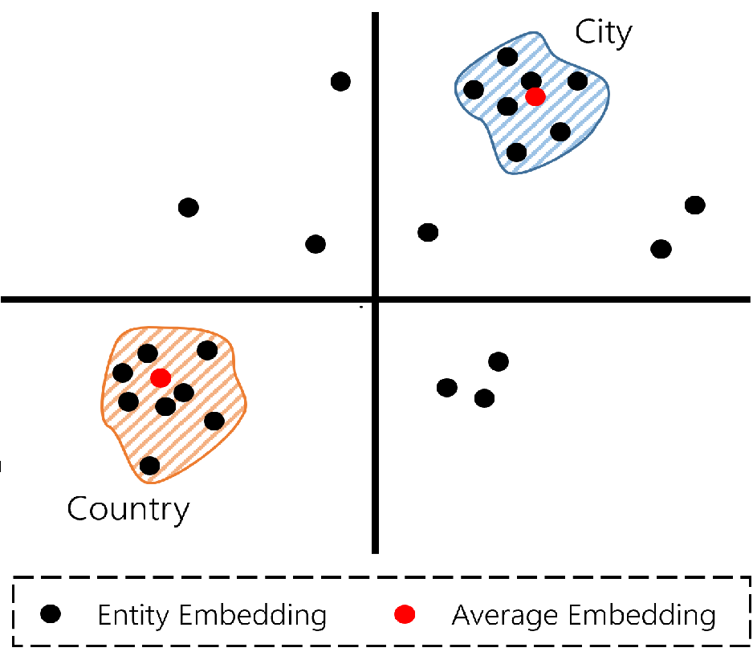

# Paper Title Here

This repository contains the datasets and script for the paper **Paper Title here**. Part of this repository has been built from  [LKGE: Lifelong Embedding Learning and Transfer for Growing Knowledge Graphs](https://github.com/nju-websoft/LKGE) and [incDE: Towards Continual Knowledge Graph Embedding via Incremental Distillation](https://github.com/seukgcode/IncDE) repositories, adding the different initialization methods to them. We will like to thank the respective authors for providing them.

The scripts have been implemented in Python3, concretely Python version 3.9.7. The main requirements to run the scripts are:
- numpy==1.26.4
- pykeen==1.11.0
- torch==2.5.1+cu118
- torch_scatter==2.1.2+pt25cu118

The repository is structured as follows:

* The main experiments can be run with the *main.py* script, which allows changing the initialization strategies, incremental learning techinques and datasets. The *experiments.sh* script contains the scripts to automatically genererate the experiments in the paper. However, to run a concrete experiment the basic syntax would be the following, where -dataset can be in *[ENTITY10, ENTITY50, ENTITY100, ENTITY200, ENTITY500, ENTITY1000]*, depending on the number of new entities added in each additional snapshot, -lifelong_name can be *LKGE*, *incDE*, *EWC*, *EMR* or *finetune*, and -init can be 0 for random initialization, 1 for ontology initialization, 3 for model initialization and 13 for text initialization. 
```bash
python main.py -dataset <dataset-name> -gpu 0 -lifelong_name <incremental-learning> -init <initialization-strategy> 
```

* The experiments to assess the ontology initialization with KGE different from TransE have been performed in PyKeen. As the library does not support incremental learning setting, the script *trainig_loop.py* has to be modified. Concretely, in the function *_train* of the *TrainingLoop* class, the step *self.model.reset_parameters_()* needs to be removed, in order to allow initializing a given KGE model with specific embedding values. The scripts for the PyKEEN experiments can be found inside the *PyKeen Experiments* directory. 
 
### Adapting the Onotlogy Initialization to your Dataset

If you would like to adapt the ontology initialization to the dataset of you choice, the only additional resource you would need to generate is a dictonary file that contains the different classes for each entity:
> class_dict = {'entity1':[class1, class5],...,'entityN':[class2, class19]}

From that, you would only need to call the initialization from the *initializations.py* script, provided that the incremental learning method of your choice allows manipulating the embeddings.

### Adapting the Ontology Initialization to you KGE method

Depending on the embedding structures of your KGE model, the *ontology_initialization* function will need to changed accordingly. For instance, some KGE models could have more than one vector for each entity/relation (e.g., complex values). Therefore, one must ensure that the initialization methods is consistent across all of them.